# Database Project

This is a Flask-based web application for managing football data (clubs, players, games, etc.).

## Prerequisites

- Python 3.x
- PostgreSQL

## Database Setup

The project is configured to connect to a PostgreSQL database with the following credentials (hardcoded in `database.py`):

- **Host**: `localhost`
- **User**: `postgres`
- **Password**: `12345678`
- **Database Name**: `DatabaseProject`

### Steps to Initialize Database:

1.  Make sure PostgreSQL is running.
2.  Create a database named `DatabaseProject`.
3.  Ensure the `postgres` user has the password `12345678` (or update `DatabaseProject/database.py` with your credentials).
4.  Run the provided SQL scripts in the `DatabaseProject` subdirectory to set up the schema and data:
    ```bash
    psql -U postgres -d DatabaseProject -f DatabaseProject/database.sql
    psql -U postgres -d DatabaseProject -f DatabaseProject/dataset.sql
    ```
    *(Adjust the command if you use a different way to run SQL files, e.g., pgAdmin).*

## Installation

1.  Create a virtual environment (optional but recommended):
    ```bash
    python -m venv venv
    ./venv/Scripts/activate  # On Windows
    # source venv/bin/activate # On macOS/Linux
    ```

2.  Install the required dependencies:
    ```bash
    pip install flask flask-login flask-wtf psycopg2-binary
    ```

## Running the Application

1.  Navigate to the inner project directory:
    ```bash
    cd DatabaseProject
    ```

2.  Run the server:
    ```bash
    python server.py
    ```

3.  The application will start on port `8090` (as defined in `settings.py`).
    Access it at: [http://localhost:8090](http://localhost:8090)

## Accounts

There are predefined accounts in `settings.py`:
- **Admin**: user `admin` (Setup with a hashed password)
- **User**: user `normaluser` / password `abcd123`

## Endpoints

### General
- `/`: Home page.

### Authentication
- `/login`: Login page.
- `/logout`: Logout page.

### Players
- `/players`: List all players.
- `/players/<competition_id>/`: List players filtered by competition.
- `/players/filter-club/<int:club_id>/`: List players filtered by club.
- `/players/<int:player_id>`: View details of a specific player.
- `/add_player`: Add a new player (Admin only).
- `/players/<int:player_id>/edit`: Edit a player (Admin only).
- `/player_delete/<int:id>/`: Delete a player (Admin only).

### Player Attributes
- `/players_attributes`: List all player attributes.
- `/player_attributes/<int:player_id>`: View attributes for a specific player.
- `/add_player_attributes`: Add player attributes (Admin only).
- `/players_attributes/<int:player_attributes_id>/edit`: Edit player attributes (Admin only).
- `/players_attributes_delete/<int:id>/`: Delete player attributes (Admin only).

### Clubs
- `/clubs`: List all clubs.
- `/clubs/<int:club_id>`: View details of a specific club.
- `/clubs/<int:competition_id>`: List clubs filtered by competition.
- `/clubs/<int:club_id>/edit`: Edit a club (Admin only).
- `/add_club`: Add a new club (Admin only).
- `/club_delete/<int:club_id>/`: Delete a club (Admin only).

### Games
- `/games`: List all games.
- `/games/<int:game_id>`: View details of a specific game.
- `/games/filter-club/<int:club_id>`: List games filtered by club.
- `/games/filter-competition/<int:competition_id>`: List games filtered by competition.
- `/games/<int:game_id>/edit`: Edit a game (Admin only).
- `/add_game`: Add a new game (Admin only).
- `/game_delete`: Delete a game (Admin only).
- `/goals/<int:game_id>`: View goals of a specific game.

## Example Pages

### Home
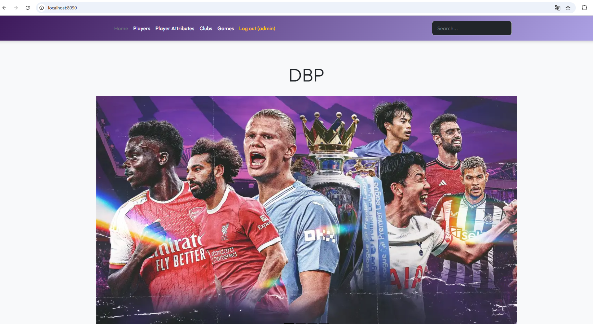

### Players
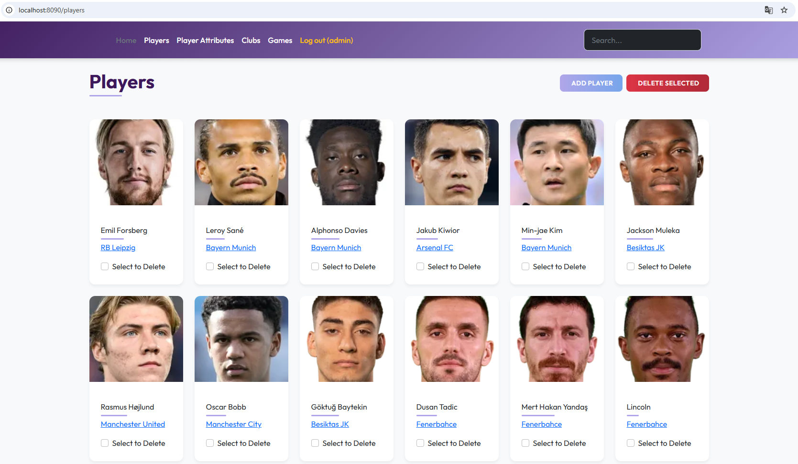

### Players of Club
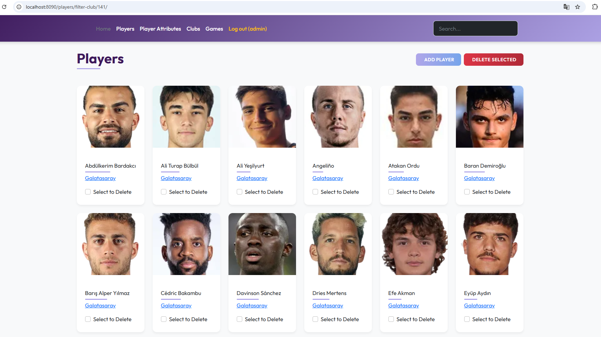

### Player Attributes
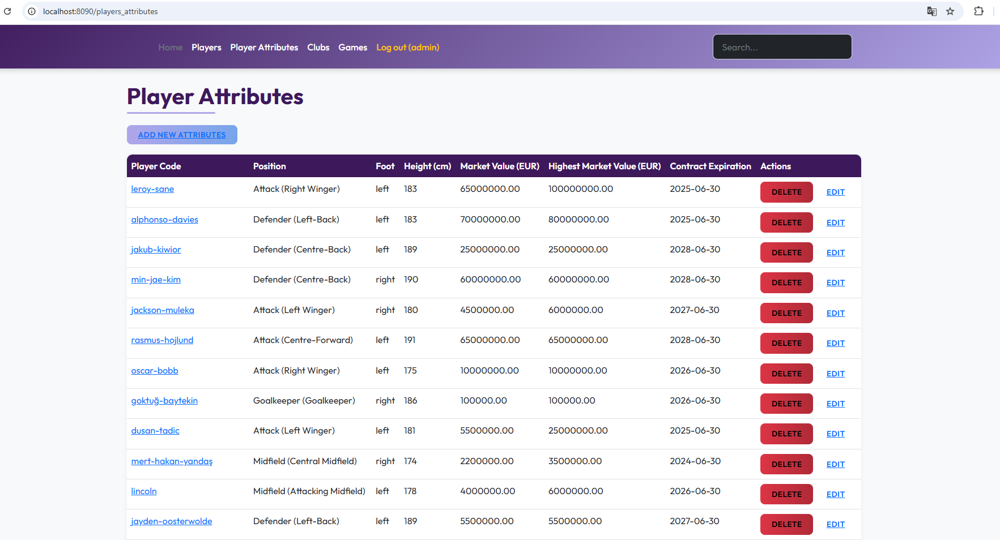

### Attributes of Player
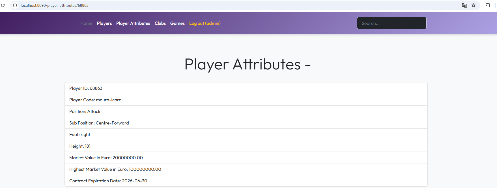

### Clubs
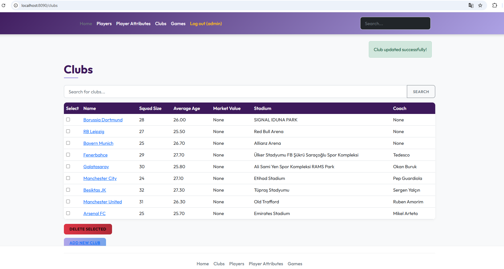

### Club Details
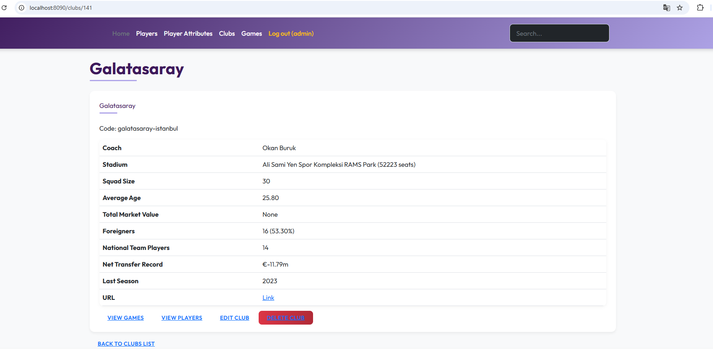

### Games
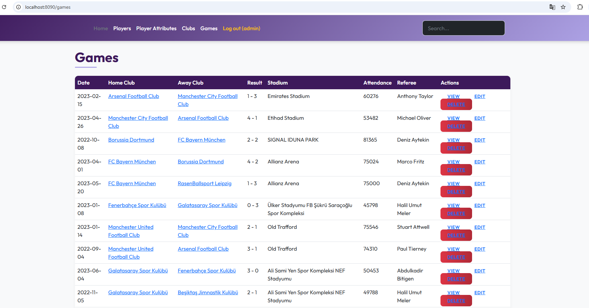

### Game Details
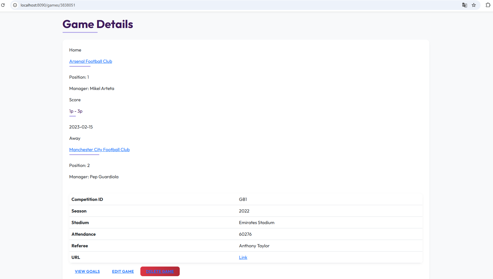

### Goals
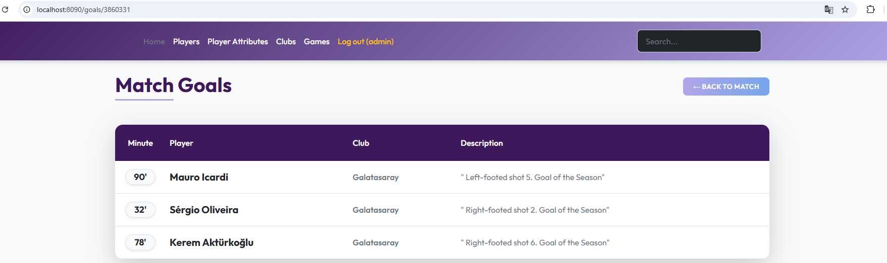

### Login
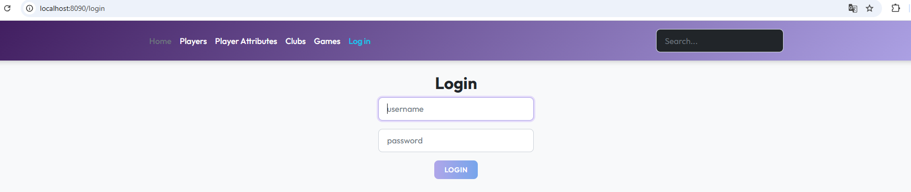
